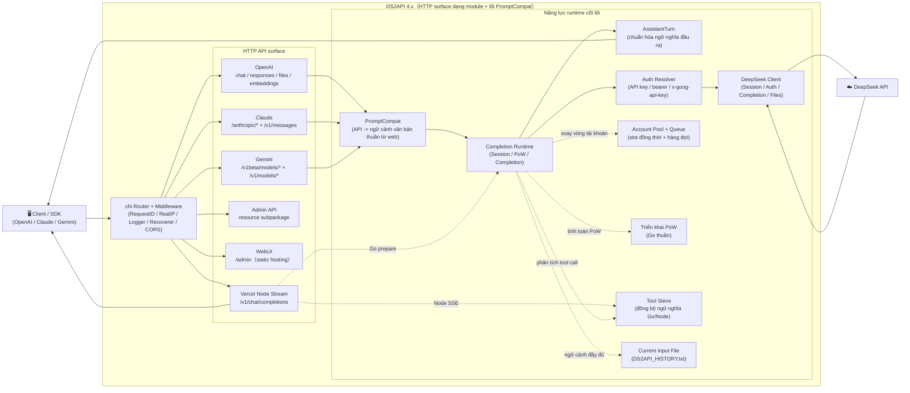

<p align="center">
  
</p>

# DS2API

<a href="https://trendshift.io/repositories/24508" target="_blank"></a>

[](LICENSE)


[](https://github.com/CJackHwang/ds2api/releases)
[](docs/DEPLOY.md)

[](https://zeabur.com/templates/L4CFHP)
[](https://vercel.com/new/clone?repository-url=https://github.com/CJackHwang/ds2api)

Ngôn ngữ / Language: [中文](README.MD) | [English](README.en.md)

Chuyển đổi khả năng hội thoại của DeepSeek Web thành API tương thích với OpenAI, Claude và Gemini. Backend cốt lõi được viết bằng **Go**; phần cầu nối stream trên Vercel sử dụng thêm một lượng nhỏ Node Runtime; frontend là React WebUI dùng làm trang quản trị, mã nguồn nằm trong `webui/`, khi deploy sẽ tự động build vào `static/admin`.

Lối vào tài liệu: [Điều hướng tài liệu](docs/README.md) / [Mô tả kiến trúc](docs/ARCHITECTURE.md) / [Tài liệu API](API.md)

【Cảm ơn cộng đồng Linux.do và các developer trong cộng đồng GitHub đã hỗ trợ và đóng góp cho dự án】

## Star History

<a href="https://www.star-history.com/?repos=cjackhwang%2Fds2api&type=date&legend=top-left">
 <picture>
   <source media="(prefers-color-scheme: dark)" srcset="https://api.star-history.com/chart?repos=cjackhwang/ds2api&type=date&theme=dark&legend=top-left" />
   <source media="(prefers-color-scheme: light)" srcset="https://api.star-history.com/chart?repos=cjackhwang/ds2api&type=date&legend=top-left" />
   
 </picture>
</a>

> **Tuyên bố miễn trừ trách nhiệm quan trọng**
>
> Repository này chỉ dùng cho mục đích học tập, nghiên cứu, thử nghiệm cá nhân và xác minh nội bộ. Dự án không cung cấp bất kỳ hình thức cấp phép thương mại, bảo đảm tính phù hợp hay bảo đảm kết quả nào.
>
> Tác giả và người duy trì repository không chịu trách nhiệm đối với bất kỳ thiệt hại trực tiếp hoặc gián tiếp nào phát sinh từ việc sử dụng, chỉnh sửa, phân phối, deploy hoặc phụ thuộc vào dự án này, bao gồm nhưng không giới hạn ở việc khóa tài khoản, mất dữ liệu, rủi ro pháp lý hoặc khiếu nại từ bên thứ ba.
>
> Không sử dụng dự án này trong các trường hợp vi phạm điều khoản dịch vụ, thỏa thuận, pháp luật, quy định hoặc quy tắc nền tảng. Trước khi sử dụng cho mục đích thương mại, vui lòng tự xác nhận `LICENSE`, các thỏa thuận liên quan và việc bạn đã có văn bản cho phép từ tác giả hay chưa.

## Mục lục

- [Tổng quan kiến trúc tóm tắt](#tổng-quan-kiến-trúc-tóm-tắt)
- [Năng lực cốt lõi](#năng-lực-cốt-lõi)
- [Ma trận tương thích nền tảng](#ma-trận-tương-thích-nền-tảng)
- [Hỗ trợ model](#hỗ-trợ-model)
  - [Giao diện OpenAI](#giao-diện-openai-get-v1models)
  - [Giao diện Claude](#giao-diện-claude-get-anthropicv1models)
  - [Giao diện Gemini](#giao-diện-gemini)
- [Bắt đầu nhanh](#bắt-đầu-nhanh)
  - [Cách 1: Tải gói build từ Release](#cách-1-tải-gói-build-từ-release)
  - [Cách 2: Chạy bằng Docker](#cách-2-chạy-bằng-docker)
  - [Cách 3: Deploy lên Vercel](#cách-3-deploy-lên-vercel)
  - [Cách 4: Chạy source code local](#cách-4-chạy-source-code-local)
- [Mô tả cấu hình](#mô-tả-cấu-hình)
- [Chế độ xác thực](#chế-độ-xác-thực)
- [Mô hình xử lý đồng thời](#mô-hình-xử-lý-đồng-thời)
- [Thích ứng Tool Call](#thích-ứng-tool-call)
- [Công cụ bắt gói khi phát triển local](#công-cụ-bắt-gói-khi-phát-triển-local)
- [Chỉ mục tài liệu](#chỉ-mục-tài-liệu)
- [Kiểm thử](#kiểm-thử)
- [Tự động build Release bằng GitHub Actions](#tự-động-build-release-bằng-github-actions)
- [Tuyên bố miễn trừ trách nhiệm](#tuyên-bố-miễn-trừ-trách-nhiệm)

## Tổng quan kiến trúc tóm tắt



Chi tiết phân tách kiến trúc và trách nhiệm từng thư mục xem tại [docs/ARCHITECTURE.md](docs/ARCHITECTURE.md).

- **Backend**: Go (`cmd/ds2api/`, `api/`, `internal/`), không phụ thuộc Python runtime
- **Frontend**: React trang quản trị (`webui/`), runtime host static build artifact
- **Deploy**: Chạy local, Docker, Vercel Serverless, Linux systemd

## Năng lực cốt lõi

| Năng lực | Mô tả |
| --- | --- |
| Tương thích OpenAI | `GET /v1/models`, `GET /v1/models/{id}`, `POST /v1/chat/completions`, `POST /v1/responses`, `GET /v1/responses/{response_id}`, `POST /v1/embeddings`, `POST /v1/files`, `GET /v1/files/{file_id}` |
| Tương thích Claude | `GET /anthropic/v1/models`, `POST /anthropic/v1/messages`, `POST /anthropic/v1/messages/count_tokens` và các path rút gọn `/v1/messages`, `/messages` |
| Tương thích Gemini | `POST /v1beta/models/{model}:generateContent`, `POST /v1beta/models/{model}:streamGenerateContent` và các path `/v1/models/{model}:*` |
| Tương thích Ollama | `GET /api/version`, `GET /api/tags`, `POST /api/show` |
| CORS thống nhất | `/v1/*`, `/anthropic/*`, `/v1beta/models/*`, `/api/*`, `/admin/*` dùng chung một bộ CORS strategy; trên Vercel, Node Runtime của `/v1/chat/completions` cũng đồng bộ cùng quy tắc allow, nhằm giảm tối đa giới hạn preflight request header từ client bên thứ ba |
| Xoay vòng nhiều tài khoản | Tự động refresh token, hỗ trợ đăng nhập bằng email hoặc số điện thoại |
| Kiểm soát hàng đợi đồng thời | Giới hạn in-flight theo từng tài khoản + hàng đợi chờ, tự động tính giá trị đồng thời khuyến nghị |
| DeepSeek PoW | Triển khai hiệu năng cao bằng Go thuần (`DeepSeekHashV1`), phản hồi cấp mili-giây |
| Tool Calling | Chống rò rỉ: nhận diện đặc trưng độ tin cậy cao ngoài code block, gửi sớm `delta.tool_calls`, xuất incremental có cấu trúc |
| Admin API | Quản lý cấu hình, hot update runtime settings, quản lý proxy, test tài khoản / test hàng loạt, dọn dẹp session, import/export, đồng bộ Vercel, kiểm tra phiên bản |
| WebUI quản trị | Single page app tại `/admin`, hỗ trợ song ngữ Trung/Anh, dark mode, xem lịch sử hội thoại phía server |
| Probe vận hành | `GET /healthz` để kiểm tra còn sống, `GET /readyz` để kiểm tra sẵn sàng |

OpenAI `/v1/*` vẫn là path chuẩn được khuyến nghị. Đồng thời dự án cũng hỗ trợ các root shortcut route như `/models`, `/chat/completions`, `/responses`, `/embeddings`, `/files`, `/files/{file_id}` để thuận tiện cho client bên thứ ba chỉ cấu hình root address của DS2API.

## Ma trận tương thích nền tảng

| Cấp độ | Nền tảng | Trạng thái hiện tại |
| --- | --- | --- |
| P0 | Codex CLI/SDK (`wire_api=chat` / `wire_api=responses`) | ✅ |
| P0 | OpenAI SDK JS/Python, chat + responses | ✅ |
| P0 | Vercel AI SDK, openai-compatible | ✅ |
| P0 | Anthropic SDK, messages | ✅ |
| P0 | Google Gemini SDK, generateContent | ✅ |
| P1 | LangChain / LlamaIndex / OpenWebUI, kết nối tương thích OpenAI | ✅ |

## Hỗ trợ model

### Giao diện OpenAI (`GET /v1/models`)

| Loại model | Model ID | thinking | search |
| --- | --- | --- | --- |
| default | `deepseek-v4-flash` | Bật mặc định, có thể điều khiển bằng request parameter | ❌ |
| default | `deepseek-v4-flash-nothinking` | Tắt vĩnh viễn, không chịu ảnh hưởng bởi request parameter | ❌ |
| expert | `deepseek-v4-pro` | Bật mặc định, có thể điều khiển bằng request parameter | ❌ |
| expert | `deepseek-v4-pro-nothinking` | Tắt vĩnh viễn, không chịu ảnh hưởng bởi request parameter | ❌ |
| default | `deepseek-v4-flash-search` | Bật mặc định, có thể điều khiển bằng request parameter | ✅ |
| default | `deepseek-v4-flash-search-nothinking` | Tắt vĩnh viễn, không chịu ảnh hưởng bởi request parameter | ✅ |
| expert | `deepseek-v4-pro-search` | Bật mặc định, có thể điều khiển bằng request parameter | ✅ |
| expert | `deepseek-v4-pro-search-nothinking` | Tắt vĩnh viễn, không chịu ảnh hưởng bởi request parameter | ✅ |
| vision | `deepseek-v4-vision` | Bật mặc định, có thể điều khiển bằng request parameter | ❌ |
| vision | `deepseek-v4-vision-nothinking` | Tắt vĩnh viễn, không chịu ảnh hưởng bởi request parameter | ❌ |

Ngoài model gốc, dự án cũng hỗ trợ các alias phổ biến như `gpt-4.1`, `gpt-5`, `gpt-5-codex`, `o3`, `claude-*`, `gemini-*`, v.v. Tuy nhiên, `/v1/models` trả về DeepSeek native model ID đã được chuẩn hóa. Nếu alias tự nó có hậu tố `-nothinking`, alias đó cũng sẽ được mapping sang model tương ứng có ngữ nghĩa bắt buộc tắt thinking. Hành vi alias đầy đủ lấy [API.md](API.md#模型-alias-解析策略) và `config.example.json` làm chuẩn.

Hiện tại upstream vision model chỉ expose kênh `vision`, không cung cấp biến thể vision riêng có web search.

### Giao diện Claude (`GET /anthropic/v1/models`)

| Model thường dùng hiện tại | Mapping mặc định |
| --- | --- |
| `claude-sonnet-4-6` | `deepseek-v4-flash` |
| `claude-sonnet-4-6-nothinking` | `deepseek-v4-flash-nothinking` |
| `claude-haiku-4-5`, tương thích `claude-3-5-haiku-latest` | `deepseek-v4-flash` |
| `claude-haiku-4-5-nothinking` | `deepseek-v4-flash-nothinking` |
| `claude-opus-4-6` | `deepseek-v4-pro` |
| `claude-opus-4-6-nothinking` | `deepseek-v4-pro-nothinking` |

Có thể override quan hệ mapping thông qua `model_aliases` trong cấu hình. Nếu tên model trong request có hậu tố `-nothinking`, kết quả mapping cuối cùng sẽ bị ép thêm ngữ nghĩa tắt thinking.

Ngoài các alias chính ở trên, `/anthropic/v1/models` cũng trả về Claude 4.x snapshots, model ID lịch sử 3.x và alias phổ biến, giúp client cũ tương thích trực tiếp.

#### Tránh lỗi khi kết nối Claude Code, đã test thực tế

- `ANTHROPIC_BASE_URL` nên trỏ trực tiếp đến root address của DS2API, ví dụ `http://127.0.0.1:5001`; Claude Code sẽ request `/v1/messages?beta=true`.
- `ANTHROPIC_API_KEY` cần trùng với `keys` trong `config.json`; khuyến nghị giữ cả key thường và dạng `sk-ant-*` để tương thích với thói quen validate của các client khác nhau.
- Nếu hệ thống có proxy, nên cấu hình `NO_PROXY=127.0.0.1,localhost,<IP máy của bạn>` cho địa chỉ DS2API để tránh request loopback local bị proxy chặn.
- Nếu gặp lỗi “tool call xuất ra dạng text, không thực thi”, hãy ưu tiên kiểm tra model output có phải là DSML tool block dùng dấu phân cách full-width được khuyến nghị không: `<｜DSML｜tool_calls><｜DSML｜invoke name="..."><｜DSML｜parameter name="...">...`. Lớp tương thích cũng chấp nhận DSML half-width và canonical XML cũ: `<tool_calls><invoke name="..."><parameter name="...">...`. Các dạng cũ như `<tools>` / `<tool_call>` / `<tool_name>` / `<param>`, `<function_call>`, `tool_use` hoặc đoạn JSON thuần `tool_calls` sẽ không được thực thi, mà được xử lý như text bình thường.

### Giao diện Gemini

Gemini adapter mapping tên model sang DeepSeek native model thông qua `model_aliases` hoặc alias chính xác tích hợp sẵn, bao phủ các tên phổ biến như `gemini-2.5-*`, `gemini-3*`, `gemini-pro-vision`, v.v. Adapter hỗ trợ hai cách gọi `generateContent` và `streamGenerateContent`, đồng thời hỗ trợ đầy đủ Tool Calling, chuyển `functionDeclarations` thành output `functionCall`. Nếu tên Gemini model có hậu tố `-nothinking`, ví dụ `gemini-2.5-pro-nothinking`, model đó sẽ được mapping sang model tương ứng bắt buộc tắt thinking.

## Bắt đầu nhanh

### Thứ tự ưu tiên lựa chọn cách deploy

Khuyến nghị chọn cách deploy theo thứ tự sau:

1. **Tải gói build từ Release để chạy**: đơn giản nhất, artifact đã được compile sẵn, phù hợp với đa số người dùng.
2. **Deploy bằng Docker / GHCR image**: phù hợp khi cần container hóa, orchestration hoặc deploy trên cloud.
3. **Deploy lên Vercel**: phù hợp khi đã có môi trường Vercel và chấp nhận các ràng buộc của nền tảng này.
4. **Chạy source code local / tự compile**: phù hợp cho phát triển, debug hoặc cần tự chỉnh sửa code.

### Bước chung đầu tiên cho mọi cách deploy

Dùng `config.json` làm nguồn cấu hình duy nhất, đây là cách được khuyến nghị:

```bash
cp config.example.json config.json
# Chỉnh sửa config.json
```

Khuyến nghị deploy về sau:

- Chạy local: đọc trực tiếp `config.json`
- Docker / Vercel: tạo `DS2API_CONFIG_JSON` dạng Base64 từ `config.json` rồi inject vào environment variable, cũng có thể ghi JSON gốc trực tiếp

“Mẫu cấu hình đầy đủ” trong WebUI quản trị cũng dùng lại cùng một `config.example.json`, vì vậy sau khi cập nhật file ví dụ, template phía frontend sẽ tự động đồng bộ.

### Cách 1: Tải gói build từ Release

Mỗi lần phát hành Release, GitHub Actions sẽ tự động build binary package cho nhiều nền tảng:

```bash
# Sau khi tải gói nén tương ứng với nền tảng
tar -xzf ds2api_<tag>_linux_amd64.tar.gz
cd ds2api_<tag>_linux_amd64
cp config.example.json config.json
# Chỉnh sửa config.json
./ds2api
```

### Cách 2: Chạy bằng Docker

```bash
# 1. Chuẩn bị environment variable và file cấu hình
cp .env.example .env
cp config.example.json config.json

# 2. Chỉnh sửa .env, tối thiểu cần set DS2API_ADMIN_KEY
#    Nếu cần đổi port trên host, có thể set thêm DS2API_HOST_PORT
#    DS2API_ADMIN_KEY=hãy_thay_bằng_mật_khẩu_mạnh

# 3. Khởi động
docker-compose up -d

# 4. Xem log
docker-compose logs -f
```

Mặc định `docker-compose.yml` sẽ map port `6011` của host sang `5001` trong container. Nếu bạn muốn expose trực tiếp `5001` ra bên ngoài, hãy set `DS2API_HOST_PORT=5001` hoặc chỉnh thủ công phần `ports`.

Đồng thời, mặc định `./config.json` sẽ được mount vào `/data/config.json` trong container và set `DS2API_CONFIG_PATH=/data/config.json`, nhằm tránh việc `/app` chỉ đọc làm token runtime không thể lưu bền vững.

Image sẽ tạo sẵn `/data` và cấp quyền cho user không phải root là `ds2api`. Nếu dùng single-file bind mount, hãy đảm bảo `config.json` trên host cho phép container user đọc/ghi, ví dụ:

```bash
chmod 644 config.json
```

Cập nhật image:

```bash
docker-compose up -d --build
```

#### Deploy một lần bằng Zeabur, dùng Dockerfile

1. Nhấn nút “Deploy on Zeabur” ở phía trên để deploy một lần.
2. Sau khi deploy xong, truy cập `/admin`, dùng `DS2API_ADMIN_KEY` trong hướng dẫn environment variable/template của Zeabur để đăng nhập.
3. Import hoặc chỉnh sửa cấu hình trong trang quản trị; cấu hình sẽ được ghi và lưu bền vững vào `/data/config.json`.

Khi Zeabur khởi động lần đầu với volume trống, có thể chưa có `/data/config.json`; DS2API sẽ khởi động trước bằng cấu hình file mode rỗng và tạo file này khi bạn lưu lần đầu trong trang quản trị.

Nếu deploy thủ công không dùng template, chọn GitHub repository service trong Zeabur, giữ Root Directory là `/`, build bằng `Dockerfile` ở root repository; thêm persistent volume `/data`, set `PORT=5001`, `DS2API_ADMIN_KEY=mật_khóa_mạnh_của_bạn`, `DS2API_CONFIG_PATH=/data/config.json`, sau đó expose HTTP port `5001`. Các bước đầy đủ hơn xem tại [docs/DEPLOY.md](docs/DEPLOY.md#不使用模板手动部署).

Lưu ý: Khi Zeabur build trực tiếp bằng `Dockerfile` trong repository, không cần truyền thêm `BUILD_VERSION`; image sẽ ưu tiên đọc build argument này, nếu không có thì tự động fallback sang file `VERSION` ở root repository.

### Cách 3: Deploy lên Vercel

1. Fork repository về GitHub của bạn
2. Import project trên Vercel
3. Cấu hình environment variable, tối thiểu cần set `DS2API_ADMIN_KEY`; khuyến nghị set thêm `DS2API_CONFIG_JSON`
4. Deploy

Khuyến nghị trước tiên copy template và điền trong thư mục repository:

```bash
cp config.example.json config.json
# Chỉnh sửa config.json
```

Khuyến nghị: trước tiên chuyển `config.json` local thành Base64 rồi dán vào `DS2API_CONFIG_JSON`, để tránh lỗi format JSON:

```bash
base64 < config.json | tr -d '\n'
```

> **Mô tả stream**: Trên Vercel, OpenAI Chat stream sẽ do `api/chat-stream.js` bằng Node Runtime xử lý, nhưng `vercel.json` chỉ rewrite path chuẩn `/v1/chat/completions` sang Node; alias root path `/chat/completions` vẫn đi qua Go main chain. Xác thực, chọn tài khoản, chuẩn bị session/PoW vẫn do internal prepare interface của Go hoàn thành; stream response, bao gồm `tools`, được xử lý ở phía Node với logic lắp ráp output và chống rò rỉ đồng bộ với Go. Nếu cần stream thời gian thực trên Vercel, hãy dùng `/v1/chat/completions`.

Chi tiết deploy xem tại [Hướng dẫn deploy](docs/DEPLOY.md).

### Cách 4: Chạy source code local

**Yêu cầu trước**: Go 1.26+, Node.js `20.19+` hoặc `22.12+` nếu cần build WebUI; CI / Docker build dùng Node 24. Đồng thời bảo đảm có `npm`, khuyến nghị `npm 10+`.

```bash
# 1. Clone repository
git clone https://github.com/CJackHwang/ds2api.git
cd ds2api

# 2. Cấu hình
cp config.example.json config.json
# Chỉnh sửa config.json, điền thông tin tài khoản DeepSeek và API key của bạn

# 3. Khởi động
go run ./cmd/ds2api
```

Địa chỉ truy cập local mặc định:

```text
http://127.0.0.1:5001
```

Service thực tế bind vào:

```text
0.0.0.0:5001
```

Vì vậy thiết bị trong cùng LAN thường cũng có thể truy cập thông qua IP nội bộ của máy bạn.

> **WebUI tự động build**: Khi khởi động local lần đầu, nếu thư mục static của WebUI chưa tồn tại, chương trình sẽ tự động thử chạy `npm ci --prefix webui` nếu thiếu dependency và `npm run build --prefix webui -- --outDir static/admin --emptyOutDir`, yêu cầu máy local có Node.js và npm. Static directory có thể override bằng `DS2API_STATIC_ADMIN_DIR`. Bạn cũng có thể build thủ công bằng:
>
> ```bash
> ./scripts/build-webui.sh
> ```

## Mô tả cấu hình

`README` chỉ giữ phần lối vào nhanh. Các field đầy đủ vui lòng lấy [config.example.json](config.example.json) làm template, đồng thời tham khảo [Hướng dẫn deploy](docs/DEPLOY.md#0-前置要求) và [Best practice cấu hình API](API.md#配置最佳实践).

Các field thường dùng:

- `keys` / `api_keys`: access key phía client; `api_keys` hỗ trợ metadata `name` và `remark`; `keys` tiếp tục được giữ để tương thích.
- `accounts`: tài khoản DeepSeek được quản lý, hỗ trợ đăng nhập bằng `email` hoặc `mobile`, có thể cấu hình proxy, tên và ghi chú.
- `model_aliases`: mapping alias model dùng chung cho OpenAI / Claude / Gemini.
- `runtime`: chiến lược đồng thời theo tài khoản, hàng đợi và refresh token, có thể hot update qua Admin Settings.
- `auto_delete.mode`: chiến lược dọn dẹp remote session sau khi request kết thúc, hỗ trợ `none` / `single` / `all`.
- `current_input_file`: chiến lược upload tách ngữ cảnh có hiệu lực toàn cục; mặc định bật và threshold là `0`. Khi được kích hoạt, toàn bộ ngữ cảnh sẽ được gộp và upload thành file ngữ cảnh `DS2API_HISTORY.txt`.
- Nếu tắt `current_input_file`, request sẽ được pass-through trực tiếp, không upload file ngữ cảnh tách riêng.
- `thinking_injection`: mặc định bật; thêm prompt tăng cường thinking vào cuối user message mới nhất để cải thiện độ ổn định khi reasoning cường độ cao và trước tool calling. Khi `prompt` để trống, sẽ dùng prompt mặc định tích hợp sẵn.

Danh sách environment variable đầy đủ xem tại [Hướng dẫn deploy](docs/DEPLOY.md). Quy tắc xác thực interface xem tại [API.md](API.md#鉴权规则).

## Chế độ xác thực

Khi gọi business interface như `/v1/*`, `/anthropic/*`, Gemini route, hỗ trợ hai chế độ:

| Chế độ | Mô tả |
| --- | --- |
| **Chế độ tài khoản được quản lý** | Truyền key nằm trong `config.keys` bằng `Bearer` hoặc `x-api-key`; service sẽ tự động xoay vòng chọn tài khoản |
| **Chế độ token pass-through** | Khi token truyền vào không nằm trong `config.keys`, token đó sẽ được dùng trực tiếp như DeepSeek token |

Request header tùy chọn `X-Ds2-Target-Account`: chỉ định dùng một tài khoản được quản lý cụ thể, giá trị là email hoặc mobile.

Nếu tài khoản được chỉ định không tồn tại, hoặc hàng đợi của tài khoản quản lý hiện tại đã đầy, request sẽ trả về `429`. Hiện tại `429` không kèm header `Retry-After`. Nếu tài khoản tồn tại nhưng đăng nhập hoặc refresh thất bại, hệ thống sẽ trả về lỗi xác thực tương ứng.

Khi không chỉ định tài khoản mục tiêu, nếu completion do upstream thinking-only empty output mà sau khi retry bù trên cùng tài khoản vẫn trả về `429 upstream_empty_output`, chế độ tài khoản được quản lý sẽ tự động chuyển sang tài khoản khả dụng tiếp theo, tạo session mới, rồi dùng payload gốc để fresh retry thêm một lần.

Gemini route còn có thể dùng `x-goog-api-key`, hoặc khi không có authentication header thì dùng `?key=` / `?api_key=` làm credential phía caller.

## Mô hình xử lý đồng thời

```text
Đồng thời khả dụng trên mỗi tài khoản = DS2API_ACCOUNT_MAX_INFLIGHT, mặc định 2
Giá trị đồng thời khuyến nghị = số tài khoản × giới hạn đồng thời mỗi tài khoản
Giới hạn hàng đợi chờ = DS2API_ACCOUNT_MAX_QUEUE, mặc định = giá trị đồng thời khuyến nghị
Ngưỡng 429 = in-flight + hàng đợi chờ ≈ số tài khoản × 4
```

- Khi slot in-flight đã đầy, request sẽ đi vào hàng đợi chờ, **không trả 429 ngay**
- Chỉ khi vượt quá tổng sức chứa mới trả về `429 Too Many Requests`; hiện tại response không kèm `Retry-After`
- 429 thuộc loại completion empty output sẽ được retry bù trên cùng tài khoản trước; trong chế độ tài khoản được quản lý, trước khi trả 429 cuối cùng còn chuyển sang tài khoản khả dụng khác để fresh retry thêm một lần
- `GET /admin/queue/status` trả về trạng thái đồng thời theo thời gian thực

## Thích ứng Tool Call

Khi request có `tools`, DS2API sẽ xử lý chống rò rỉ và chuyển đổi có cấu trúc:

1. Chỉ bật nhận diện toolcall thực thi trong ngữ cảnh **không nằm trong code block**; ví dụ trong code block mặc định sẽ không kích hoạt.
2. Parser hiện xem DSML wrapper dùng dấu phân cách full-width là dạng gọi thực thi được khuyến nghị: `<｜DSML｜tool_calls>` → `<｜DSML｜invoke name="...">` → `<｜DSML｜parameter name="...">`; đồng thời tương thích DSML half-width, canonical XML cũ `<tool_calls>` → `<invoke name="...">` → `<parameter name="...">`, cũng như một số trường hợp drift ở prefix/delimiter DSML. DSML chỉ là alias lớp vỏ; bên trong vẫn phân tích ngữ nghĩa theo XML. Các dạng cũ như `<tools>` / `<tool_call>` / `<tool_name>` / `<param>`, `<function_call>`, biến thể `tool_use` / antml và đoạn JSON thuần `tool_calls` đều sẽ được xử lý như text bình thường. Wrapper đầy đủ nhưng malformed cũng sẽ được release như text bình thường.
3. `responses` stream sử dụng nghiêm ngặt event lifecycle chính thức của item: `response.output_item.*`, `response.content_part.*`, `response.function_call_arguments.*`.
4. `responses` hỗ trợ và thực thi `tool_choice`: `auto` / `none` / `required` / forced function. Khi `required` bị vi phạm, non-stream trả về `422`, stream trả về `response.failed`.
5. Client request protocol nào thì trả về tool call theo native structure của protocol đó: OpenAI / Claude / Gemini. Phía model ưu tiên ràng buộc output theo XML chuẩn, sau đó lớp tương thích chuyển đổi.

> Lưu ý: Phiên bản hiện tại của parser ưu tiên “cố gắng parse thành công”; mọi XML tool call hợp lệ về format đều sẽ đi qua, không lọc tool name bằng allow-list.
>
> Parser sẽ giữ lại tham số là empty string rõ ràng hoặc chỉ gồm whitespace. Prompt sẽ yêu cầu model không chủ động output empty parameter; việc từ chối thiếu tham số hoặc command rỗng nên do phía tool executor hoặc client schema validation phụ trách.
>
> Nếu muốn đánh giá phương án “đóng gói tool call thành XML rồi đưa vào model”, có thể tham khảo: `docs/toolcall-semantics.md`.

## Công cụ bắt gói khi phát triển local

Dùng để định vị các vấn đề như `responses thinking stream` / tool call. Sau khi bật, công cụ sẽ tự động ghi lại request body và response body upstream gần nhất của N cuộc hội thoại DeepSeek, mặc định 20 bản ghi; vượt quá sẽ tự loại bỏ bản cũ. Mỗi response body mặc định ghi tối đa 5 MB.

Ví dụ bật:

```bash
DS2API_DEV_PACKET_CAPTURE=true \
DS2API_DEV_PACKET_CAPTURE_LIMIT=20 \
go run ./cmd/ds2api
```

Truy vấn hoặc xóa, yêu cầu Admin JWT:

- `GET /admin/dev/captures`: xem danh sách bản ghi bắt gói, mới nhất ở trước
- `DELETE /admin/dev/captures`: xóa toàn bộ bản ghi bắt gói
- `GET /admin/dev/raw-samples/query?q=từ_khóa&limit=20`: tìm kiếm bản ghi bắt gói hiện có trong memory theo keyword của câu hỏi, rồi gom theo `chat_session_id` thành chuỗi `completion + continue`
- `POST /admin/dev/raw-samples/save`: lưu một chuỗi bản ghi bắt gói khớp thành replay sample trong `tests/raw_stream_samples/<sample-id>/`

Các field trả về bao gồm:

- `request_body`: request body đầy đủ gửi tới DeepSeek
- `response_body`: nội dung stream gốc từ upstream sau khi ghép lại
- `response_truncated`: có bị cắt do vượt giới hạn kích thước mỗi bản ghi hay không

API lưu sample hỗ trợ chọn mục tiêu bằng `query`, `chain_key` hoặc `capture_id`. Ví dụ:

```json
{"query":"thời tiết Quảng Châu","sample_id":"gz-weather-from-memory"}
```

## Chỉ mục tài liệu

| Tài liệu | Mô tả |
| --- | --- |
| [API.md](API.md) / [API.en.md](API.en.md) | Tài liệu API interface, gồm ví dụ request/response |
| [DEPLOY.md](docs/DEPLOY.md) / [DEPLOY.en.md](docs/DEPLOY.en.md) | Hướng dẫn deploy: local / Docker / Vercel / systemd |
| [CONTRIBUTING.md](docs/CONTRIBUTING.md) / [CONTRIBUTING.en.md](docs/CONTRIBUTING.en.md) | Hướng dẫn đóng góp |
| [TESTING.md](docs/TESTING.md) | Hướng dẫn sử dụng bộ test |

## Kiểm thử

Hướng dẫn kiểm thử chi tiết xem tại [docs/TESTING.md](docs/TESTING.md).

### Lệnh kiểm thử nhanh

```bash
# Gate PR local
./scripts/lint.sh
./tests/scripts/check-refactor-line-gate.sh
./tests/scripts/run-unit-all.sh
npm run build --prefix webui

# Kiểm thử end-to-end toàn chuỗi, dùng tài khoản thật, sinh log request/response đầy đủ
./tests/scripts/run-live.sh
```

## Tự động build Release bằng GitHub Actions

Workflow file: `.github/workflows/release-artifacts.yml`

- **Điều kiện kích hoạt**: Mặc định chỉ tự động kích hoạt khi GitHub Release được `published`; cũng hỗ trợ chạy thủ công bằng `workflow_dispatch` trong trang Actions và điền `release_tag` để chạy lại hoặc phát hành bù.
- **Build artifact**: Gói binary đa nền tảng: `linux/amd64`, `linux/arm64`, `linux/armv7`, `darwin/amd64`, `darwin/arm64`, `windows/amd64`, `windows/arm64`; Linux Docker image export package + `sha256sums.txt`.
- **Phát hành container image**: Chỉ push lên GHCR: `ghcr.io/cjackhwang/ds2api`.
- **Mỗi gói nén binary bao gồm**: file thực thi `ds2api`, `static/admin`, `config.example.json`, `.env.example`, `README.MD`, `README.en.md`, `LICENSE`.

## Tuyên bố miễn trừ trách nhiệm

Dự án này được triển khai dựa trên phương pháp reverse engineering, chỉ dùng cho mục đích học tập, nghiên cứu, thử nghiệm cá nhân và xác minh nội bộ. Dự án không cung cấp bất kỳ cấp phép thương mại, bảo đảm ổn định hay bảo đảm khả dụng nào.

Tác giả và người duy trì repository không chịu trách nhiệm đối với bất kỳ thiệt hại trực tiếp hoặc gián tiếp nào phát sinh từ việc sử dụng, chỉnh sửa, phân phối, deploy hoặc phụ thuộc vào dự án này, bao gồm nhưng không giới hạn ở việc khóa tài khoản, mất dữ liệu, rủi ro pháp lý hoặc khiếu nại từ bên thứ ba.

Không sử dụng dự án này trong các trường hợp vi phạm điều khoản dịch vụ, thỏa thuận, pháp luật, quy định hoặc quy tắc nền tảng. Trước khi sử dụng cho mục đích thương mại, vui lòng tự xác nhận `LICENSE`, các thỏa thuận liên quan và việc bạn đã có văn bản cho phép từ tác giả hay chưa.
